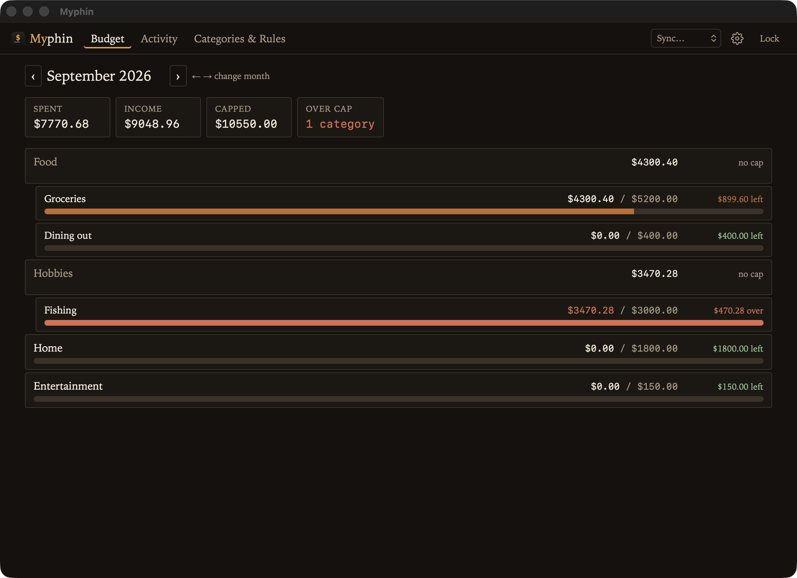
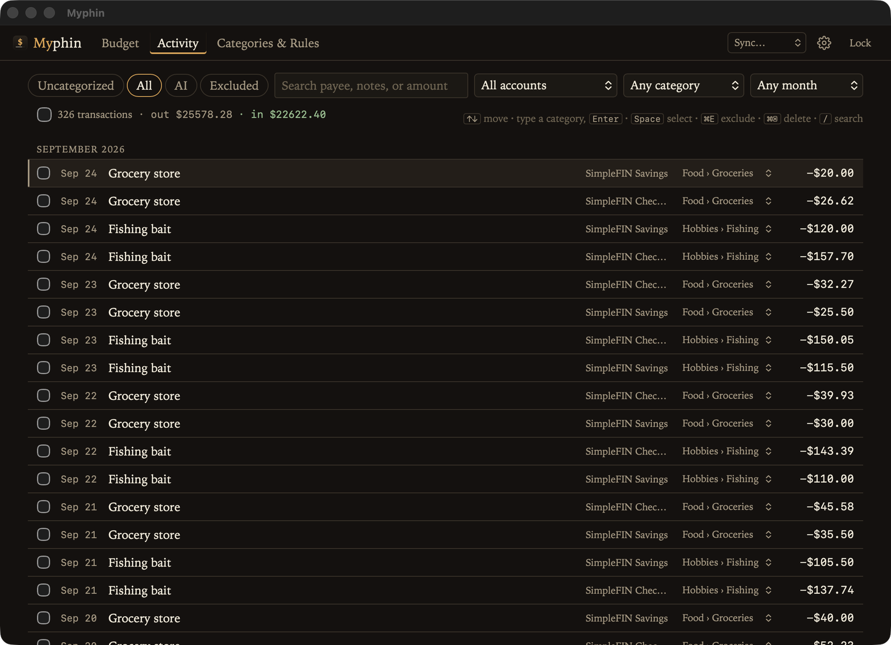
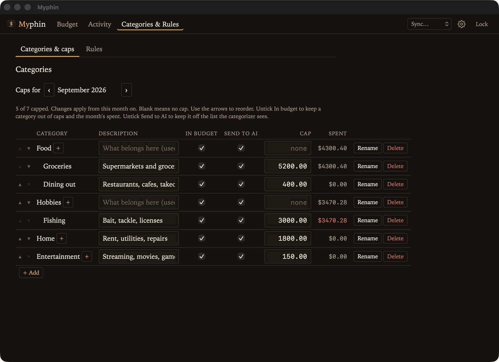
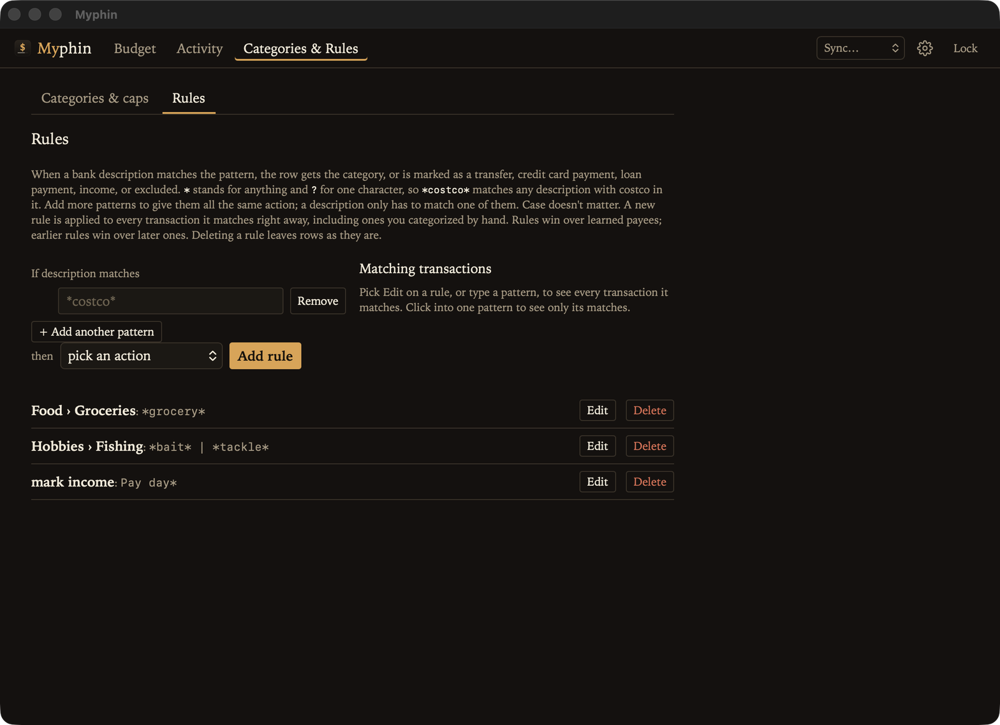
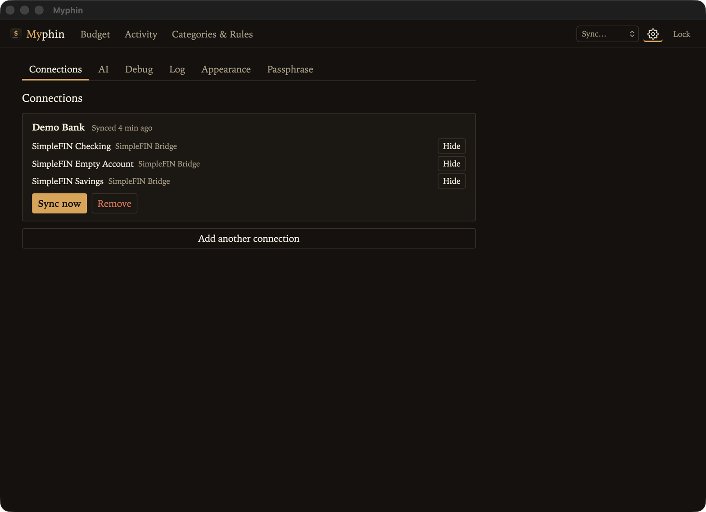

# Myphin

**A private, keyboard-friendly budget app that keeps your money data in a folder you own.**

Myphin pulls in your bank transactions, helps you sort them into categories, and shows how each category is doing against a monthly cap. There's no account to sign up for and no cloud service holding your data. Everything lives in one encrypted file, in a folder you pick.



## Why Myphin

- **Your data stays yours.** The ledger is a single encrypted file (`ledger.enc`). Put the folder in iCloud Drive, Syncthing, or wherever you already keep backups.
- **Real bank data.** Transactions sync through [SimpleFIN Bridge](https://bridge.simplefin.org/), which connects to many banks and card issuers.
- **Fast to categorize.** Arrow through transactions, type the first few letters of a category, press Enter. Myphin remembers payees so you rarely do it twice.
- **Rules that do the boring part.** `*costco*` → Groceries. Rules apply instantly to past and future rows, and you see what a pattern matches before you save it.
- **Monthly caps, not spreadsheets.** Set a cap once and it carries forward. The Budget screen shows what's left and what's over at a glance.
- **Optional AI help.** For payees nothing else covers, Myphin can ask an AI model to suggest a category. It only sends the payee name and whether money went in or out.

## A quick tour

### Budget

See the month at a glance: total spent, income, and every category's progress toward its cap. Categories can nest one level (like `Food › Groceries`), and a parent rolls up its children's spending. Use `←` and `→` to move between months.

### Activity

Every transaction in one list. Filter by account, category, or month, or search by payee, notes, or amount. Chips at the top jump to what needs attention: Uncategorized rows, rows the AI sorted for you to review, and anything you've excluded.



### Categories and caps

Add categories, nest them, and set a monthly cap on each. A short description on each category helps the AI pick the right one. You can keep a category out of the budget entirely (it still gets tracked, it just doesn't count toward caps), or keep it off the list the AI sees.



### Rules

A rule matches the bank's description with simple wildcards (`*` for anything, `?` for one character). It can set a category, or mark a row as a transfer, credit card payment, loan payment, income, or excluded. Payments and transfers never count as spending. You can also create a rule straight from a transaction in Activity.



### Setup

Connect banks, hide accounts you don't care about, pick a theme (Ledger, Ink, Paper, or Newsprint), configure AI, and change your passphrase.



## Getting started

### 1. Install the tools

- [Rust](https://rustup.rs/) 1.93 or newer
- [Dioxus CLI](https://dioxuslabs.com/learn/0.7/getting_started/): `cargo install dioxus-cli`
- macOS needs nothing else. Linux needs WebKitGTK (see the Dioxus desktop docs). Windows needs WebView2.

### 2. Run it

```bash
git clone <this-repo>
cd myphin
dx serve --desktop
```

### 3. Create your ledger

On first launch, pick an empty folder and choose a passphrase. Myphin creates an encrypted ledger there.

> **Write your passphrase down.** It's never stored anywhere, so there's no way to recover it if you forget.

### 4. Connect your bank

1. Get a setup token from [SimpleFIN Bridge](https://bridge.simplefin.org/simplefin/create). Want to try it first? Grab a demo token from the [developer page](https://beta-bridge.simplefin.org/info/developers).
2. In Myphin, open Setup (the gear, top right), paste the token, and click Connect.
3. Sync. Later you can re-sync any connection from the **Sync…** menu in the top bar.

### 5. Start sorting

Go to Categories & Rules and add a few categories. Then head to Activity, pick the Uncategorized chip, and start typing. Add rules for anything that repeats.

## AI categorization (optional)

Myphin can send rows that no rule or remembered payee covers to an AI model. It picks a category using your category descriptions and only applies it when it's confident enough (70% by default, adjustable).

You have two options, both set up in Setup → AI:

- **[typesafe.ai](https://typesafe.ai)**, a hosted service. Paste your API key.
- **A model you run yourself** with [lmr-rs](https://github.com/faulker/lmr-rs), on this machine or elsewhere on your network. No API key needed. [openbmb/MiniCPM5-2B-GGUF](https://huggingface.co/openbmb/MiniCPM5-2B-GGUF) gives the best local results (`lmr-rs models download minicpm5-2b`, then `lmr-rs serve`). A Metal build (`--features metal`) is much faster than CPU on a Mac.

Only the payee name and whether money went in or out are ever sent. Rows the AI categorized get an `ai` tag, and the AI chip in Activity lists them so you can double-check. To see exactly what goes over the wire, use "Debug a transaction" in Setup → AI.

Full details, including how to host a model and add a new provider, are in [`docs/ai.md`](docs/ai.md).

## Keyboard shortcuts

In Activity:

| Key | What it does |
| --- | --- |
| `↑` / `↓` | Move between rows |
| Type + `Enter` | Set the category (a unique prefix is enough) |
| `Space` | Select a row |
| `⌘E` | Exclude |
| `⌘⌫` twice | Delete |
| `/` | Jump to search |

On the Budget screen, `←` and `→` change the month. The full list is in [`docs/ui-spec.md`](docs/ui-spec.md).

## Privacy and security

- The ledger is encrypted with Argon2id and XChaCha20-Poly1305. Your passphrase is never saved.
- SimpleFIN access URLs and AI keys are stored inside the encrypted ledger and never written to logs.
- All connections use HTTPS. The one exception is a self-hosted model on your local network, which may use plain HTTP.
- While Myphin is open, a temporary unlocked copy (`.workspace.sqlite`) sits in the data folder. It's deleted when you quit. **Sync `ledger.enc`, not that file.**

### Changing your passphrase

Setup → Passphrase re-encrypts the ledger. Myphin keeps `ledger.enc.backup` under the old passphrase until you successfully unlock with the new one. If that unlock fails, quit, replace `ledger.enc` with `ledger.enc.backup`, and use the old passphrase.

## For developers

### Build

```bash
dx bundle --desktop     # release bundle (.app on macOS)
cargo build --release
```

`cargo run` also works, but styles only load through `dx`, so use `dx serve --desktop` for day-to-day work.

### Test

```bash
cargo test
cargo test -- --ignored   # live tests: SimpleFIN demo token (network), local lmr-rs
```

### Debug tools

Setup → Debug adds two buttons to each row's editor in Activity: **Raw data** (the bank's original JSON for that transaction) and **AI trace** (the exact request and response for that payee). Both read from the ledger and send nothing.

### Project layout

- `src/providers`: `TransactionSource` trait, SimpleFIN, and the `Transport` HTTP abstraction
- `src/ai`: `Categorizer` trait, shared wire code, typesafe.ai and lmr-rs providers, the AI pass
- `src/sync`: windowed fetch, importer, dedup
- `src/store`: encrypted SQLite
- `src/domain`: categories, caps, rules, splits
- `src/ui`: Budget, Activity, Categories & Rules, Setup
- `assets`: `main.css` and the app icon (`icon.svg` source, `icon.png` for `cargo run`, `icon.icns` for bundles)
- `docs/simplefin.md`: SimpleFIN protocol notes
- `docs/ui-spec.md`: screens and keys
- `docs/ai.md`: AI categorization and adding a provider
- `docs/screenshots`: images used in this README

Built with Rust and [Dioxus](https://dioxuslabs.com/). One crate, no npm.
